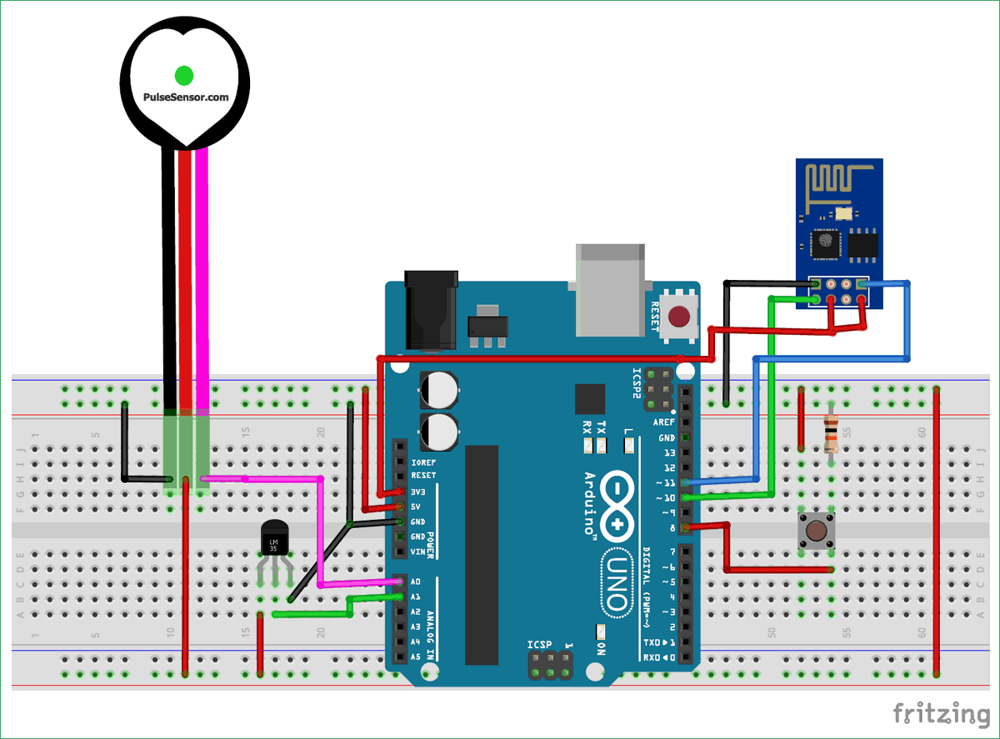

# Biofeedback Loop System for Anxiety Management in Real-Time

## Description  
This system uses **Arduino** to monitor physiological signals such as **heart rate, blood oxygen levels (SpO2), skin conductance, respiratory rate, and breathing patterns**. It detects anxiety levels in real-time and provides **visual, auditory, or haptic feedback** to help users regulate stress. The system also integrates a **WiFi module (ESP8266/ESP32) and a mobile app** to send **instant alerts** and recommend relaxation techniques when anxiety levels are high. This **IoT-based** solution is ideal for **therapy, meditation, and self-care applications**, offering a **personalized, data-driven approach** to emotional well-being.  

## Components Used  
- **Arduino Uno** – Microcontroller for data processing  
- **Pulse Oximeter (MAX30102/MAX30100)** – Measures heart rate and blood oxygen (SpO2) levels  
- **GSR Sensor** – Detects skin conductance for stress analysis  
- **Respiratory Sensor** – Monitors breathing rate and patterns  
- **WiFi Module (ESP8266/ESP32)** – Sends alerts via a mobile app  
- **Buzzer, LEDs, and Vibration Motor** – Provides real-time feedback (auditory, visual, or haptic)  
- **LCD Display** – Shows real-time anxiety level readings  
- **Power Supply (Battery/Adapter)** – Powers the system  

## Key Features  
✅ **Real-Time Anxiety Detection** – Monitors and analyzes physiological signals  
✅ **Visual, Auditory, and Haptic Feedback** – Alerts the user in real-time  
✅ **IoT-Based Mobile App Notifications** – Sends alerts via WiFi to the user’s phone  
✅ **Cloud Data Storage** – Logs anxiety data for long-term monitoring  
✅ **Personalized Stress Management** – Suggests relaxation techniques  

## Installation & Setup  
### 1. **Hardware Setup**  
- Connect **Pulse Oximeter, GSR sensor, and Respiratory Sensor** to **Arduino**  
- Connect **ESP8266/ESP32 WiFi module** for mobile app notifications  
- Wire **buzzer, LEDs, and vibration motor** for real-time alerts  
- Connect the **LCD Display** to show real-time readings  

### 2. **Software Setup**  
- Install **Arduino IDE** and required libraries:  
  ```cpp
  #include <Wire.h>
  #include <Adafruit_Sensor.h>
  #include <ESP8266WiFi.h>
  #include <MAX3010x.h>

Upload the code to Arduino Uno

3. Mobile App Setup
- Install Blynk/Adafruit IO App for IoT-based alerts
- Connect to ESP8266/ESP32 WiFi module
- Set up real-time notifications for anxiety alerts

## Source Code
 ```cpp
#include <Wire.h>
#include <WiFi.h>
#include "MAX30105.h" 
#include <ESP8266WiFi.h>

// WiFi Credentials
const char* ssid = "Your_WiFi_Name";
const char* password = "Your_WiFi_Password";

// Initialize sensors
MAX30105 particleSensor;
int gsrPin = A0;  // GSR sensor pin
int breathPin = A1;  // Respiratory sensor pin
int buzzer = 5;  
int led = 6;  
WiFiServer server(80);

void setup() {
  Serial.begin(115200);
  pinMode(gsrPin, INPUT);
  pinMode(breathPin, INPUT);
  pinMode(buzzer, OUTPUT);
  pinMode(led, OUTPUT);

  // WiFi Connection
  WiFi.begin(ssid, password);
  while (WiFi.status() != WL_CONNECTED) {
    delay(500);
    Serial.print(".");
  }
  Serial.println("Connected to WiFi!");
  
  // Initialize Heart Rate Sensor
  if (!particleSensor.begin(Wire, I2C_SPEED_STANDARD)) {
    Serial.println("MAX30105 sensor not found!");
    while (1);
  }
}

void loop() {
  int gsrValue = analogRead(gsrPin);
  int breathValue = analogRead(breathPin);
  float heartRate = particleSensor.getHeartRate();
  
  Serial.print("GSR: "); Serial.print(gsrValue);
  Serial.print(" | Respiratory: "); Serial.print(breathValue);
  Serial.print(" | Heart Rate: "); Serial.println(heartRate);

  if (gsrValue > 800 || breathValue < 200 || heartRate > 120) { 
    Serial.println("Anxiety Detected!");
    digitalWrite(buzzer, HIGH);
    digitalWrite(led, HIGH);
    delay(500);
    digitalWrite(buzzer, LOW);
    digitalWrite(led, LOW);
    
    WiFiClient client = server.available();
    if (client) {
      client.println("ALERT: Anxiety Levels High! Take deep breaths.");
      delay(2000);
      client.stop();
    }
  }
  delay(1000);
}
```

## Final Setup



## How It Works
1. Sensors measure heart rate, blood oxygen, skin conductance, and breathing patterns
2. Data is analyzed in real-time to detect anxiety levels
3. Alerts are given via buzzer, LEDs, and vibration for immediate feedback
4. Mobile app notifications inform users about their stress levels and recommend relaxation techniques

## Future Scope
- Integrate AI for personalized anxiety management
- Store and analyze user data for long-term insights
- Add machine learning to improve anxiety detection accuracy
- Develop a fully integrated mobile app with breathing exercises
